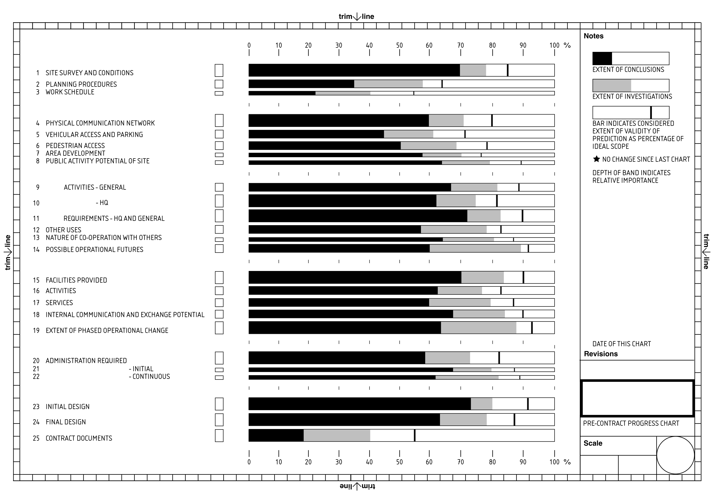

# CP Progress Chart

This repository presents three states of Cedric Price’s pre-contract progress chart:

1. **cp-progress-chart-facsimile.svg**
   archival reconstruction / reference version

2. **cp-progress-chart-blank.svg**
   open template for renewed inscription

3. **cp-progress-chart-working-draft.svg**
   current evolving research version

Together these files demonstrate architecture as a process of **progressing** through circulation, reinterpretation, and renewed authorship.

## Intended sequence

Although GitHub lists files alphabetically, the intended methodological sequence is:

**facsimile → blank → working draft**

## File Versioning and Revision Protocol

This repository is maintained as an archival and research-led record of facsimile drawing development for the Cedric Price Supplement No. 3 BMI drawings.

Minor technical corrections that do not alter the scholarly meaning of a file (for example line alignment, export settings, typographic correction, or restoration of omitted vector elements) are replaced in place under the existing filename. The full revision history is preserved through Git commit history.

Substantive revisions that alter interpretation, reconstruction method, or evidential basis are preserved as new file versions using an incremented suffix, for example:

`cp-progress-chart-facsimile-v2.svg`

Distinct methodological states are identified through descriptive filenames such as:

- `blank`
- `facsimile`
- `working-draft`
- `interpretive-overlay`

This protocol distinguishes technical correction from interpretive revision and supports transparent scholarly provenance.

## License

This work is licensed under the Creative Commons Attribution-ShareAlike 4.0 International License.
